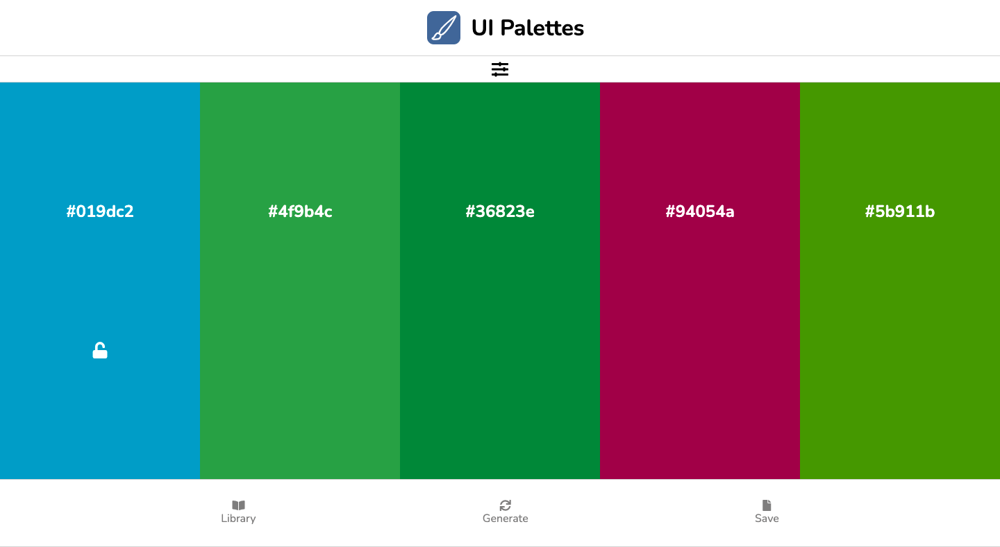

# Responsive Color generation app

Pure JS app for creating and localy saving color palettes.

## Technologies I used in this project

- HTML, CSS, JS
- [ChromaJS](https://gka.github.io/chroma.js/)

